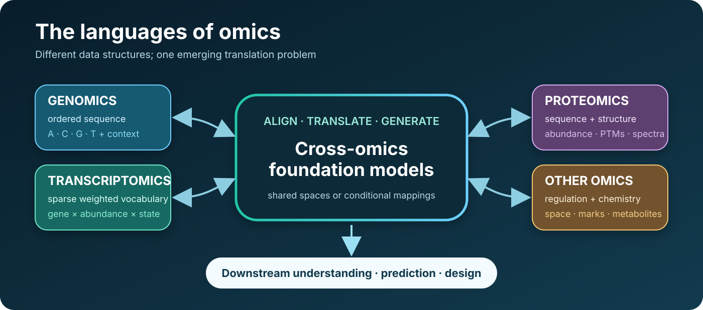
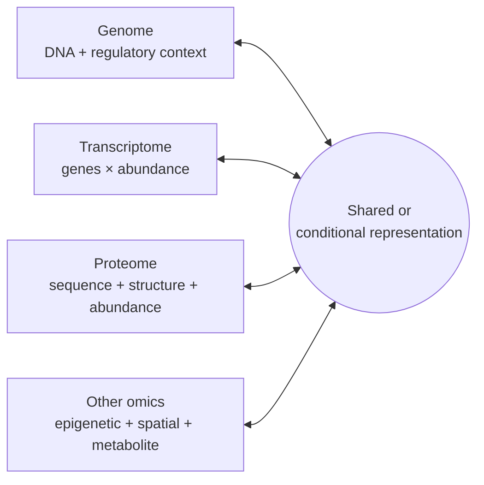

# The Languages of Omics

> **Can AI Become Biology's Universal Translator?**

AI has learned to understand human language and images from large amounts of data. Biology is a different challenge. Genomics, transcriptomics, proteomics, and spatial omics were developed to measure different aspects of biological systems. As these data continue to grow, AI is beginning to learn the patterns and relationships that connect them. This talk explores what is possible today, what remains difficult, and why careful scientific validation still matters.

This companion repository provides a curated, evidence-linked map of foundation models for genomics, transcriptomics, proteomics, RNA, epigenomics, spatial omics, metabolomics, and the bridges between them.



**Last literature sweep:** 2026-08-25 · **Catalog:** 42 models · **Scope:** omics-specific foundation models and explicit cross-modal bridges

## Why this list is different

Biology does not expose one convenient language:

| Omics layer | A useful language analogy | What the model actually receives |
|---|---|---|
| Genomics | a very long sentence in a four-letter alphabet | ordered DNA bases, variants, or regulatory tracks |
| Transcriptomics | a weighted bag of words | genes plus sparse abundance values, conditioned on cell state |
| Proteomics | sentences in an amino-acid alphabet | protein sequence, structure, function text, abundance, or mass spectra |
| Epigenomics | regulatory markup on the genome | accessible regions, motifs, methylation, histone marks, and cell context |
| Spatial omics | molecular language with grammar supplied by place | expression plus coordinates, neighborhoods, graphs, or tissue images |
| Metabolomics | a spectrum of molecular fragments | mass-to-charge peaks, intensities, and candidate molecular structures |

The central question is therefore not merely whether one model can tokenize every assay. It is whether models can **align, translate, and generate across representations without erasing the biology unique to each layer**.

## Start with the frontier

These are useful anchors for a current talk; they are not a leaderboard.

| Model | Year | Reads | Translates or predicts | Why it matters |
|---|---:|---|---|---|
| [Evo 2](https://www.nature.com/articles/s41586-026-10176-5) | 2026 | DNA at single-nucleotide resolution | variation, function, and genome-scale generation | open, long-context model spanning all domains of life |
| [AlphaGenome](https://www.nature.com/articles/s41586-025-10014-0) | 2026 | 1 Mb DNA sequence | thousands of regulatory tracks and variant effects | a high-resolution sequence-to-function anchor |
| [TranscriptFormer](https://doi.org/10.1126/science.aec8514) | 2026 | gene identities plus expression counts | generative cell representations across 12 species | treats the transcriptome as a generative cell atlas |
| [Stack](https://doi.org/10.64898/2026.01.09.698608) | 2026 | sets of single-cell transcriptomes | unseen cellular conditions via in-context learning | moves from single-cell sentences to contextual cell populations |
| [ESM3](https://doi.org/10.1126/science.ads0018) | 2025 | protein sequence, structure, and function | any-to-any protein generation | a multimodal protein design model |
| [Orthrus](https://www.nature.com/articles/s41592-026-03064-3) | 2026 | mature RNA isoforms | RNA properties and functional/evolutionary similarity | uses RNA-specific biological augmentations rather than text alone |
| [Nicheformer](https://www.nature.com/articles/s41592-025-02814-z) | 2025 | dissociated and spatial transcriptomes | spatial context and niche labels | shows why coordinates and neighborhoods are not optional metadata |
| [CAPTAIN](https://www.nature.com/articles/s41467-026-72882-y) | 2026 | co-assayed RNA and surface proteins | joint cell states and protein abundance | a direct transcriptome ↔ proteome bridge |
| [DreaMS](https://pmc.ncbi.nlm.nih.gov/articles/PMC13090125/) | 2025 | tandem mass spectra | transferable molecular representations | brings self-supervised foundation modeling to metabolomics spectra |
| [MIMIC](https://arxiv.org/abs/2604.24506) | 2026 | sequence, structure, regulation, evolution, context | conditional reconstruction and design across biomolecules | the clearest current “universal translator” prototype; still a preprint |

## Browse the map

- [Full model catalog](CATALOG.md) — generated tables, grouped by primary omics layer
- [Talk overlay](docs/talk-overlay.md) — slide-ready narrative, wording, and caveats
- [Selection method](docs/selection-method.md) — what qualifies, evidence rules, and limitations
- [Machine-readable catalog](catalog/models.json) — consistent metadata for every entry
- [Contributing](CONTRIBUTING.md) — how to add or update a model

## The translator layer



Three distinct claims are often blurred together:

1. **One tokenizer:** multiple data types are serialized for one architecture.
2. **One embedding space:** paired observations are aligned for retrieval or transfer.
3. **A translator:** the model can infer or generate one modality from another, including uncertainty.

Only the third deserves the strongest “universal translator” language. The catalog records each model's input and output languages so those claims remain distinguishable.

## Use the catalog

Validate the metadata and regenerate the human-readable catalog using only Python's standard library:

```bash
python scripts/validate_catalog.py
python scripts/render_catalog.py --check
```

To rebuild `CATALOG.md` after an accepted change:

```bash
python scripts/render_catalog.py
```

## Important caveat

Model scale is not evidence of biological validity. Single-cell foundation models, for example, have sometimes failed to outperform simpler baselines in independent evaluations. This repository records availability and publication status, but it does not treat paper-reported benchmarks as interchangeable or clinically validated.

## Origins and license

This is an original, talk-centered successor inspired by the earlier [Awesome Bio-Foundation Models](https://github.com/apeterswu/Awesome-Bio-Foundation-Models) list. It narrows the organizing principle from “biological model type” to **omics language and translation direction**, while retaining links back to primary papers and official artifacts.

Repository content is available under the [MIT License](LICENSE).
