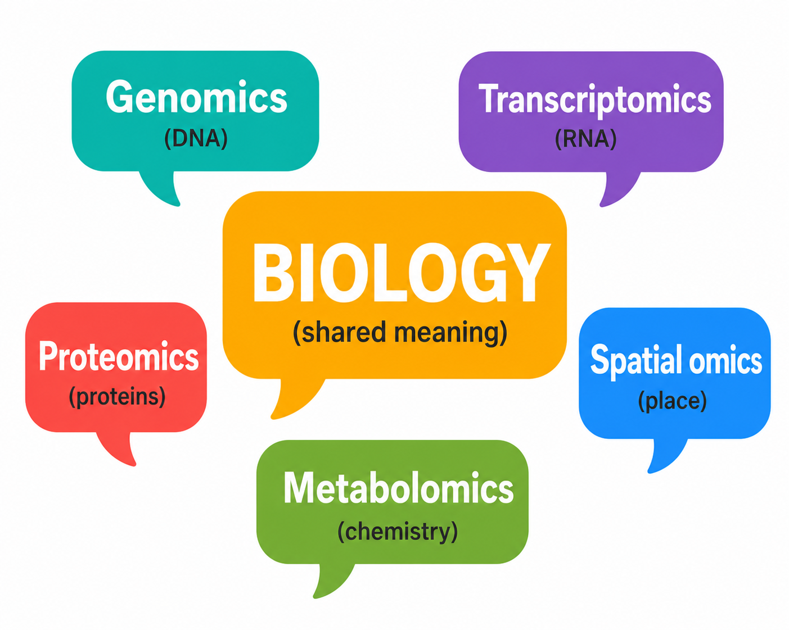

# Talk overlay: The Languages of Omics

This guide maps the catalog onto the talk theme **“Can AI Become Biology's Universal Translator?”** It is designed to replace a flat list of model names with a progression from distinct omics grammars to cross-modal translation.

## The one-slide thesis

> Omics measurements are not one language written in different alphabets. They are different data structures—sequences, sparse weighted sets, molecular graphs, spectra, and spatial fields. A biological foundation model becomes a translator only when it preserves those structures while aligning or generating across them.

## Opening visual: a parallel language analogy

Place the two speech-bubble graphics side by side:

| Human languages | Omics languages |
|---|---|
|  |  |

Suggested narration:

> In human language, different words can point to shared meaning. Omics platforms do something analogous: genomics, transcriptomics, proteomics, spatial omics, and metabolomics observe the same biological system through different measurement languages. The translation problem is to connect those views without pretending that they are interchangeable.

## A clearer overlay for the existing slide

| Layer | Suggested phrasing | Token or unit | Grammar / context | Representative models |
|---|---|---|---|---|
| Genomics | “A genome is an ordered, very long message in a four-letter alphabet.” | base, k-mer, learned DNA token | strand, distance, haplotype, chromatin and evolutionary context | Evo 2, AlphaGenome, Nucleotide Transformer, Caduceus |
| Transcriptomics | “A transcriptome is a sparse, weighted vocabulary describing a cell state.” | gene plus expression value | gene programs, cell type, condition, donor, time | TranscriptFormer, Stack, State, scGPT |
| Proteomics | “A protein is a sentence, but a proteome is more than a set of sentences.” | amino acid, structure token, protein abundance, MS peak | folding, complexes, PTMs, localization, dynamics | ESM3, DPLM-2, ProTrek, BioEmu, MSFM |
| Epigenomics | “The epigenome is context-sensitive regulatory markup on the genome.” | accessible peak, motif, methylated base, histone track | cell type, locus, cis/trans regulation | GET, EpiAgent, EpiGePT, ChromFound |
| Spatial omics | “Spatial omics adds syntax supplied by position and neighborhood.” | molecular feature plus coordinate or cell pair | tissue architecture, niches, cell–cell interaction | Nicheformer, SpatialFormer, scGPT-spatial, spEMO |
| Metabolomics | “The metabolome is observed indirectly through fragment patterns.” | mass-to-charge peak plus intensity | fragmentation, instrument, collision energy, chemical structure | DreaMS, LSM-MS2, MSAlign |

### Why “bag of words” needs one qualifier

“Bag of words” is a memorable description of a single-cell expression vector, but **weighted, sparse, and contextual** is more accurate. Genes have abundance values; dropout creates false zeros; and the same gene set means different things across cell types, disease states, and perturbations. TranscriptFormer models gene identity and count jointly, while Stack explicitly lets cells contextualize one another.

### Why protein sequence is not the whole proteome

Protein language models usually learn from sequence repositories. Proteomics experiments often observe abundances, peptides, post-translational modifications, or mass spectra instead. In the talk, distinguish:

- **protein foundation models:** sequence / structure / function, and
- **proteomic foundation models:** measured protein states or spectra.

That distinction creates a natural transition from ESM3 or DPLM-2 to CAPTAIN and MSFM.

## A 7-slide narrative

### 1. Biology produces several languages

Show the five omics layers simultaneously. Use different shapes, not just different colors, to signal different data structures.

### 2. Tokenization is an inductive bias

Contrast single bases, k-mers, gene ranks, expression values, amino acids, structure tokens, spatial cell pairs, and spectral peaks. The point: tokenization decides which biological invariances are easy or hard to learn.

### 3. Genomics: scale and sequence-to-function

Use Evo 2 for open generative scale and AlphaGenome or GET for sequence/regulatory-context-to-function. These are complementary model classes, not direct substitutes.

### 4. Transcriptomics: from cell sentences to virtual cells

Progress from Geneformer/scGPT to TranscriptFormer, State, and Stack. Separate representation learning from counterfactual perturbation prediction.

### 5. Proteomics and RNA: structure changes the grammar

Use ESM3 or DPLM-2 for sequence–structure generation, BioEmu for ensembles, and Orthrus/RiNALMo for RNA-specific structural and evolutionary constraints.

### 6. Other omics restore missing context

Overlay epigenomic regulation, spatial neighborhoods, and metabolomic spectra. Nicheformer is a useful example because its pretraining directly tests the cost of discarding spatial context.

### 7. The universal translator is emerging—not solved

Place LucaOne, CAPTAIN, CellWhisperer, MIMIC, and spEMO in the center. Label the kind of bridge each one provides:

- LucaOne: DNA / RNA / protein sequence representation
- CAPTAIN: single-cell RNA ↔ surface protein
- CellWhisperer: transcriptome ↔ natural language
- spEMO: spatial expression / protein ↔ histopathology / text embeddings
- MIMIC: partially observed multimodal biomolecular state ↔ missing modalities

End with the gap: none currently provides a fully validated, uncertainty-aware translation among genome, epigenome, transcriptome, proteome, metabolome, and phenotype across organisms and contexts.

## A useful visual test

For every arrow on a slide, ask three questions:

1. Is this **alignment**, **prediction**, or **generation**?
2. Was the mapping trained on paired measurements, weak labels, or only co-occurrence?
3. What uncertainty or biological context is lost in translation?

If an arrow cannot answer those questions, draw it as a hypothesis rather than an established capability.

## Claims to avoid

- “Bigger is always better.” Independent single-cell benchmarks do not support that generalization.
- “Open source” when only inference code or an API is available.
- “Multimodal” when modalities are merely concatenated after separate preprocessing.
- “Understands biology” when evidence is limited to paper-specific predictive benchmarks.
- “Universal” for a model spanning only sequence alphabets but not cell, tissue, or assay context.

## Closing line

> The opportunity is not to force every omic into one language. It is to build models fluent enough to translate between them while preserving what cannot be translated away.
